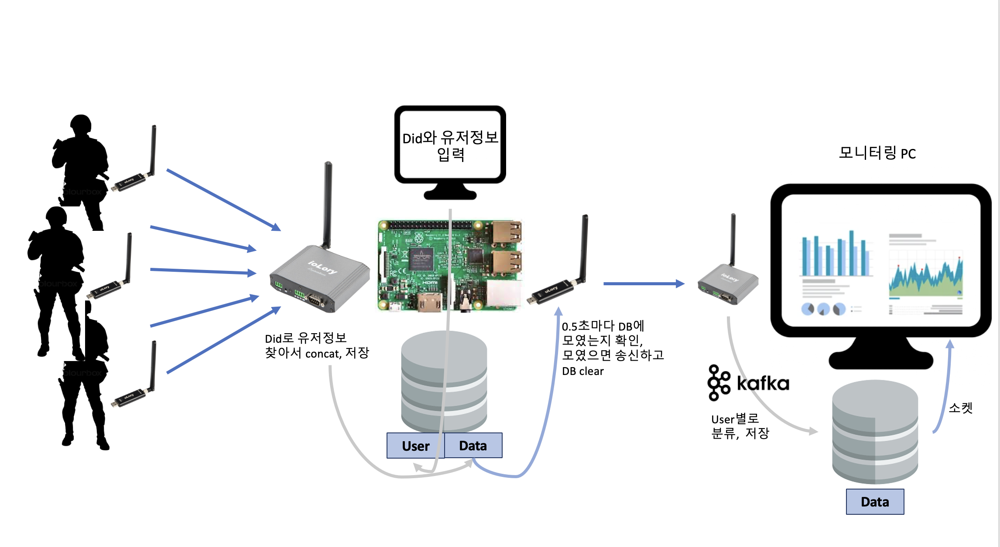

### 프로젝트 구성, 데이터플로우

---

### 문제해결방식

---
- 단거리 Lory(기동대원 착용) 틱 sync 제한
    - 단거리 송신Lory가 time을 가지지 않아 수신된 데이터의 소실, 누락 등 확인 어려운 문제
    - Lory는 하나의 Destination에만 데이터를 송신할 수 있다. 하나의 수신Lory가 10대의 송신Lory와 데이터를 교환하며 틱을 동기화할 수 없는 문제
    → 송수신 Lory 간 time sync. 기기 시작 시 송신Lory의 틱과 수신Lory의 time을 기록해 시간 흐름을 계산
    

- ioLory 송수신 데이터 제한
    - ioLory의 송수신 데이터 크기가 116byte로 제한됨
    - 기동대원 1인의 (가속도 센서3,자이로 센서3,호흡,심박,체온,타임스탬프,dId, uId) 약 50byte
    → 일반 txt 형태로 데이터 송신
    → 중계기는 1인 기동대원 데이터 수신 즉시 함선으로 송신(10인 모두 따로)
    

