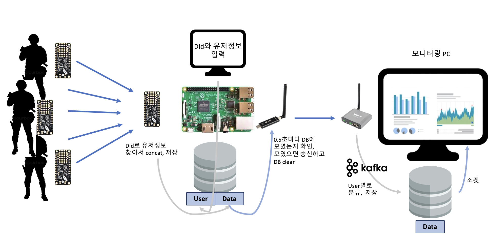

# 고성능병렬임베디드컴퓨팅 연구실
## 2022.09 ~ 2023.05

---
## 해경(오션랩)-불법 외국어선 단속강화-생체신호 센싱 프로젝트

#### 작전 수행중인 해경 기동대원 한 팀(10인)의 생체 신호를 실시간으로 중계, 함선에서 대원의 행위와 상태를 모니터링하는 시스템

## 회고
---
### 프로젝트 시작
임베디드컴퓨팅연구실에서 학부연구생으로 정부-기업 연계 프로젝트에 참여한 적이 있습니다. 해당 프로젝트는 해경 특수 기동대원의 생체 신호 센싱 및 원격 모니터링 시스템 구축이 목표였습니다. 저는 해상 환경에서 센서 데이터를 송수신하는 통신 모듈과 이 데이터로 행위를 인식하는 학습모델 구현을 맡았습니다. 처음 경험하는 하드웨어, 머신러닝 프로젝트인 데에 더해 한 달이라는 시간적 제한이 있어 어려움이 있었습니다.

### 레퍼런스 부족
LoRa모듈로 통신망을 구축하는 데에 레퍼런스가 부족한 문제가 있었습니다. 장거리 통신을 위한 장비로 ioLory와 uLory를 제공받았으나, 이들로 LoRa 통신망을 구성하기 위한 레퍼런스가 거의 없었습니다. 그래서 기기 전력 공급부터 설정, 프로그래밍까지 혼자 시행착오를 겪으며 통신망을 완성했습니다. 가령 처음에 제조사 매뉴얼로 기기 스펙과 통신 설정법을 알았지만 기기의 설정 터미널에 진입할 수 없었습니다. 포트로 데이터가 수신되나 ioLory에서 송신신호가 없는 것으로 보아 전력 문제라 판단했습니다. 그래서 매뉴얼의 용어 중 전력 공급과 관련될 법한 용어를 모두 조사했고, ‘단자대’의 정보를 찾다가 파워서플라이어에 대해 알게 되었습니다. 그리고 이를 ioLory에 연결해 데이터 송신단을 구축했습니다. 이처럼, 생소한 문제에 부딪힐 때 매뉴얼과 작더라도 공통점이 있는 다른 사례를 꼬리 물기 식으로 파보며 문제를 해결할 수 있었습니다.

### 학습모델 구현
약 2주의 시간 내에 빠르게 학습모델을 구현해야 하는 문제가 있었습니다. 머신러닝에 대한 기반을 먼저 쌓고 싶었지만, 시간적 제한이 있기 때문에 시계열 데이터에 적합한 모델과 생체 신호를 통한 행위 인식 방법을 집중적으로 공부해야겠다고 판단했습니다. 그래서 LSTM 모델에 대한 논문과 센서 데이터로 행위를 판단하는 연구 논문 30여편, Tensorflow keras 라이브러리를 활용한 오픈 소스 코드 10여개를 분석했습니다. 그리고 결과적으로 기한 내 93% 정확도의 LSTM모델을 구현할 수 있었습니다.

## DataFlow

---

### 중계기 단거리 Lory 형태

### 함선 장거리 Lory 형태

## 문제정의와 해결

---

<aside>
    🛠 <em>작전 출동 시마다 대원의 착용 기기 달라짐</em>
    
</aside>

    - 작전 시 동원되는 단속정에서 기기 DId와 대원의 정보(Id, 이름)를 라즈베리파이 DB에 저장.
    - 단거리 송신Lory(센서)는 생체신호의 자신의 DId와 생체신호를 하나의 txt로 송신
    
    → 단거리 수신Lory DId로 대원 정보 찾아 데이터에 concat한 후 함선에 송신

<aside>
    🛠 <em>단거리 Lory(기동대원 착용) 틱 sync 제한</em>
    
</aside>

    - 단거리 송신Lory가 time을 가지지 않아 수신된 데이터의 소실, 누락 등 확인 어려운 문제
    - Lory는 하나의 Destination에만 데이터를 송신할 수 있다. 
      하나의 수신Lory가 10대의 송신Lory와 데이터를 교환하며 틱을 동기화할 수 없는 문제
    
    → 송수신 Lory 간 time sync. 기기 시작 시 송신Lory의 틱과 수신Lory의 time을 기록해 시간 흐름을 계산
    

<aside>
    🛠 <em>ioLory 송수신 데이터 제한</em>
    
</aside>

    - ioLory의 송수신 데이터 크기가 116byte로 제한됨
    - 기동대원 1인의 (가속도 센서3,자이로 센서3,호흡,심박,체온,타임스탬프,dId, uId) 약 50byte

    → 일반 txt 형태로 데이터 송신
    
    → 중계기는 1인 기동대원 데이터 수신 즉시 함선으로 송신(10인 각각 따로)

<aside>
    🛠 <em>수신 중복으로 데이터 변형 위험</em>
    
</aside>

    - 한 번에 많은 인원의 데이터가 수신될 시 데이터 손상 위험
    - 단거리 수신Lory 초당 10회 포트에서 데이터 수신
    - 한 번에 수신되지 못한 데이터는 다음 수신에 수신
    - 단거리 송신Lory 초당 1회 데이터 송신

    
    → 단거리 수신Lory 함선으로 장거리 송신과 함께 라즈베리파이 SQLite DB에 데이터 저장

    → 함선에서 데이터 누락 확인 시 단속정에 누락된 타임스탬프의 데이터 요청

