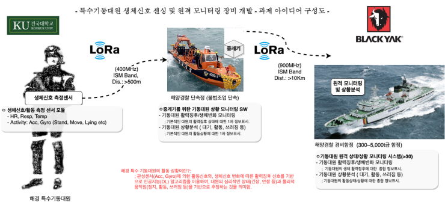
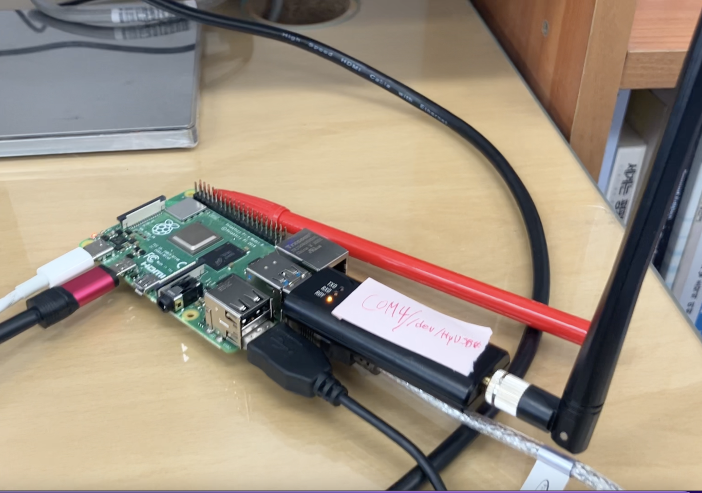
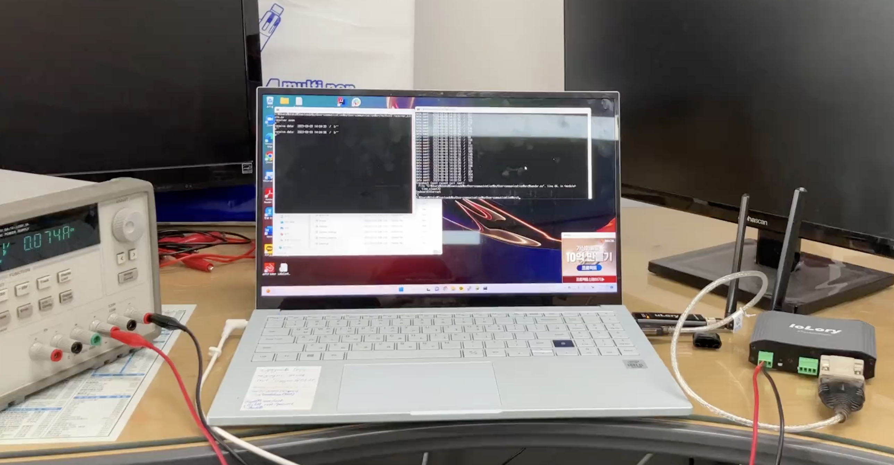

### 프로젝트 소개

---
## 해경(오션랩)-불법 외국어선 단속강화-생체신호 센싱

작전 수행중인 기동대원 한 팀(10인)의 생체 신호를 실시간으로 중계, 함선에서 대원의 행위와 상태를 모니터링하는 시스템

### DataFlow

---

## 중계기 단거리 Lory 형태

## 함선 장거리 Lory 형태

### 문제해결방식

---

<aside>
🛠 작전 출동 시마다 대원의 착용 기기 달라짐
</aside>

    - 작전 시 동원되는 단속정에서 기기 DId와 대원의 정보(Id, 이름)를 라즈베리파이 DB에 저장.
    - 단거리 송신Lory(센서)는 생체신호의 자신의 DId와 생체신호를 하나의 txt로 송신
    
    → 단거리 수신Lory DId로 대원 정보 찾아 데이터에 concat한 후 함선에 송신

<aside>
🛠 단거리 Lory(기동대원 착용) 틱 sync 제한
</aside>

    - 단거리 송신Lory가 time을 가지지 않아 수신된 데이터의 소실, 누락 등 확인 어려운 문제
    - Lory는 하나의 Destination에만 데이터를 송신할 수 있다. 
      하나의 수신Lory가 10대의 송신Lory와 데이터를 교환하며 틱을 동기화할 수 없는 문제
    
    → 송수신 Lory 간 time sync. 기기 시작 시 송신Lory의 틱과 수신Lory의 time을 기록해 시간 흐름을 계산
    

<aside>
    🛠 <em>ioLory 송수신 데이터 제한</em>
</aside>

    - ioLory의 송수신 데이터 크기가 116byte로 제한됨
    - 기동대원 1인의 (가속도 센서3,자이로 센서3,호흡,심박,체온,타임스탬프,dId, uId) 약 50byte

    __→ 일반 txt 형태로 데이터 송신__
    
    → 중계기는 1인 기동대원 데이터 수신 즉시 함선으로 송신(10인 각각 따로)

<aside>
🛠 수신 중복으로 데이터 변형 위험
</aside>

    - 한 번에 많은 인원의 데이터가 수신될 시 데이터 손상 위험
    - 단거리 수신Lory 초당 10회 포트에서 데이터 수신
    - 한 번에 수신되지 못한 데이터는 다음 수신에 수신
    - 단거리 송신Lory 초당 1회 데이터 송신
    
    → 단거리 수신Lory 함선으로 장거리 송신과 함께 라즈베리파이 SQLite DB에 데이터 저장

    → 함선에서 데이터 누락 확인 시 단속정에 누락된 타임스탬프의 데이터 요청

